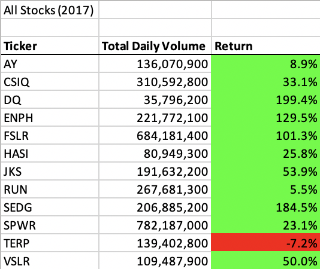
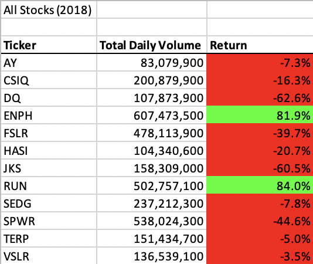
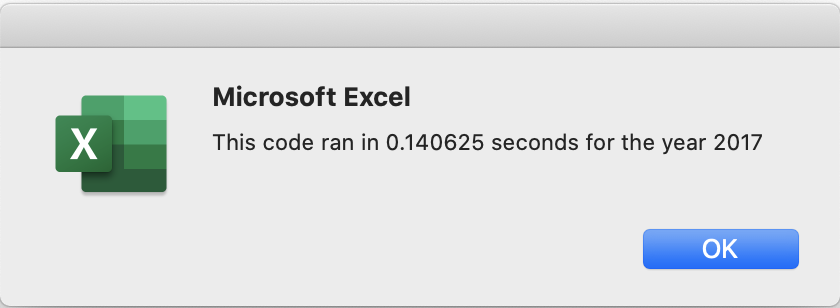
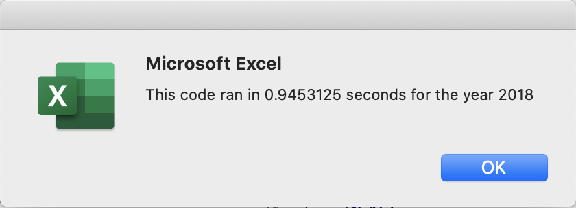
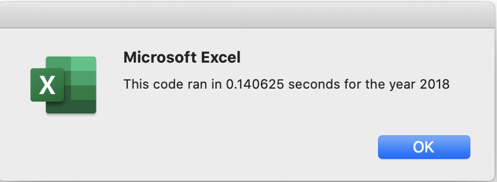

# Kickstarting with Excel

## Overview of Project

### Purpose

The purpose of this analysis was to help refactor the code to analyze stocks for Steve's parents. We had an existing codebase but we wanted to improve the time it took to execute. By refactoring the code, we were able to achieve our goal.

## Results

### Stock Analysis

From the results, we can see that the green stocks' performance was much better during 2017 than 2018. There are many more stocks that had a positive return in 2017 (all except one) compared to 2018 (only two).

### Execution Time Analysis

As we can see in the images below, by refactoring the code we were able to improve the execution time from 0.9 seconds to 0.1 seconds.

## Summary

- What are the advantages or disadvantages of refactoring code?

One advantage of refactoring code is that you can improve its performance and make it look better. One disadvantage is that because you may be rewriting another person's code, you may not fully understand it and might break it or make it more vulnerable to edge cases after refactoring.

- How do these pros and cons apply to refactoring the original VBA script?

We can see that refactoring the VBA script helped improve its execution time, which relates to the pro mentioned above. In regards to the con, we may have created some vulnerabilities from changing the code, though that is hard to tell with the current parameters assigned.

